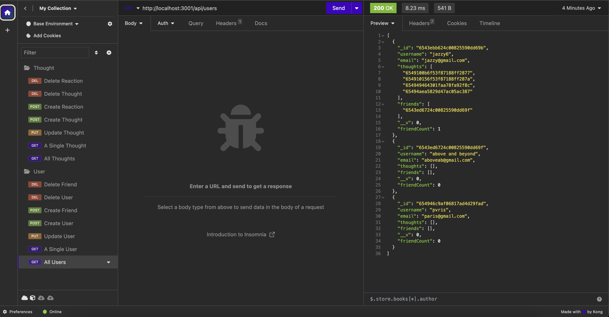

# Social-Network API

## Table of Contents 

- [Description](#description)
- [Installation](#installation)
- [Usage](#usage)
- [Badges](#badges)
- [License](#License)
- [How to Contribute](#how-to-contribute)

## Description

This application is an API for a social network. The API can be used to create users and thoughts, reactions to thoughts, and create a friend list.

## Installation

1. Clone the repository to you local IDE.

2. Install the [Insomnia](https://insomnia.rest/download) program.

3. Install the [MongoDB](https://www.mongodb.com/docs/manual/administration/install-community/) program.

4. Run ```npm install``` in your local IDE terminal to install the required dependencies.

5. Run ```node index.js``` to start the server.

## Usage

Open the Insomnia program and navigate to the GET/POST/PUT/DELETE routes for users, friends, thoughts, and reactions by entering the following URLs:

http://localhost:3001/api/thoughts

GET route can be used to retrieve all thoughts, POST route can be used to create thoughts

http://localhost:3001/api/thoughts/:thoughtId

GET route can be used to retrieve a single thought with a thought ID, PUT route can be used to update a specific thought with a thought ID, DELETE route can be used to update a specific thought with a thought ID

http://localhost:3001/api/thoughts/:thoughtId/reactions

POST route can be used to create a reaction

http://localhost:3001/api/thoughts/:thoughtId/reactions/reactionID

DELETE route can be used to delete a reaction

http://localhost:3001/api/users

GET route can be used to retrieve all users, POST route can be used to create users

http://localhost:3001/api/users/:userId

GET route can be used to retrieve a single user with a user ID, PUT route can be used to update a specific user with a user ID, DELETE route can be used to delete a specific user with a user ID

http://localhost:3001/api/users/:userId/friends/:userId

POST route can be used to create a friend

http://localhost:3001/api/users/:userId/friends/:friendID

DELETE route can be used to delete a friend

Below is an example of the /users GET route.



Check out a walkthrough video [here](https://drive.google.com/file/d/1KhK1Qh83OAbNmQo-OrvjyZ689hzwT--p/view).

## License


## Badges

 

Badges used can found [here](https://github.com/Ileriayo/markdown-badges).

## How to Contribute

Please contact me via my [Github](https://github.com/Kiararj) if you would like to contribute. 